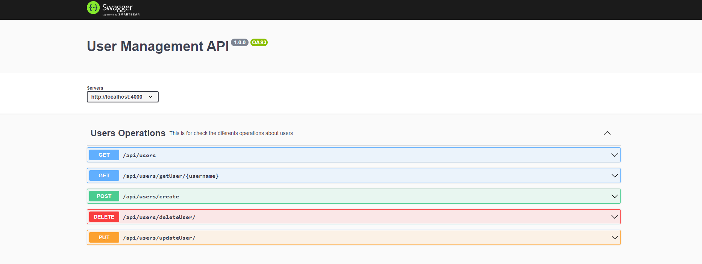

# MONGODB_GETTING_STARTED

MongoDB_Getting_Started: Reto Nuwe de introducción a base de datos no relacionales

Sistema de gestión básico de usuarios.

## API

Para conocer en detalle los diferentes endpoints de la API se ha documentado con swagger.
Clona o descarga el repositorio para poder acceder a la documentación.<br>
https://localhost:4000/api-docs


## Installation


```shell
    # Fist Clone
    git clone https://github.com/NandoLT/nuwe_backend_mongodb_Starting
    # Before install dependencies
    npm i 
```

```shell
    # run api in production
    npm start
    # run api in development
    npm run dev
```

## License 

[ISC](https://opensource.org/licenses/ISC)